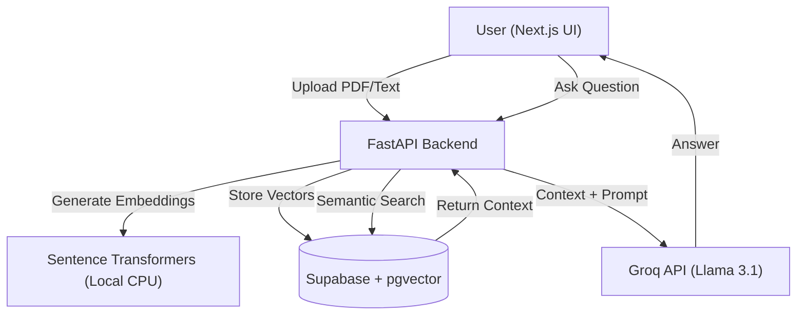

# 🔒 THE VAULT


> **An Enterprise-Grade RAG (Retrieval Augmented Generation) System.**

> *Securely ingest documents, vectorize knowledge, and chat with your private data using local embeddings and cloud-native LLMs.*

---

## 📸 Demo


---

## 🧐 The Problem

Standard LLMs (like ChatGPT) cannot access your private files, legal contracts, or internal documentation. Uploading sensitive data to public models poses a security risk.

## 💡 The Solution: The Vault

The Vault is a **Private Knowledge Engine**. It uses **RAG (Retrieval Augmented Generation)** to turn your static documents (PDFs, Notes) into a searchable vector index.

When you ask a question, The Vault:

1.  **Searches** your private database for the most relevant paragraphs (Semantic Search).

2.  **Retrieves** that context.

3.  **Feeds** it to Llama 3.1 to generate a precise answer with **citations**.

---

## 🏗️ Architecture

This project is built using a modern **Microservices** architecture:



## 🚀 Tech Stack

### Frontend (The Face)

- **Next.js 14 (App Router)**: For server-side rendering and swift UI updates.
- **Tailwind CSS**: For a responsive, "Dark Mode" futuristic aesthetic.
- **Lucide React**: For lightweight, beautiful iconography.

### Backend (The Logic)

- **FastAPI**: Chosen for its high performance and native Async support (crucial for AI streaming).
- **Python 3.12 + uv**: Using the latest package manager for lightning-fast dependency resolution.
- **PyPDF**: Robust PDF parsing and text extraction.

### AI & Data (The Brains)

- **Groq LPU**: Leveraging Language Processing Units for sub-100ms inference speeds (Llama 3.1 8B).
- **Supabase (pgvector)**: Storing high-dimensional embeddings (384 dimensions) for semantic similarity search.
- **Sentence-Transformers**: Running all-MiniLM-L6-v2 locally to convert text to vectors without API costs.

## ⚡ Key Features

- 📄 **Multi-Format Ingestion**: Drag-and-drop support for PDFs and direct Text Notes.
- 🧠 **Semantic Understanding**: Finds information based on meaning, not just keywords. (e.g., "Cost" finds "Price").
- ⚡ **Real-Time Latency**: Optimized pipeline ensures answers are generated in under 1 second.
- 🛡️ **Hallucination Guardrails**: The AI is strictly instructed to answer only based on the provided context, citing sources.

## 🛠️ Getting Started

Follow these steps to run The Vault locally.

### Prerequisites

- Node.js 18+
- Python 3.12
- Supabase Account

### 1. Clone the Repo

```bash
git clone https://github.com/yourusername/THE-VAULT.git
cd THE-VAULT
```

### 2. Backend Setup

```bash
cd the-vault
# Create .env file with GROQ_API_KEY and DATABASE_URL
uv sync
uv run python main.py
```

Server runs on `http://127.0.0.1:8000`

### 3. Frontend Setup

```bash
cd vault-ui
npm install
npm run dev
```

UI runs on `http://localhost:3000`

## 🔮 Future Roadmap

- [ ] Multi-User Auth: Integrating Clerk/NextAuth for user sessions.
- [ ] Chat History: Storing conversation threads in Postgres.
- [ ] Multi-Modal Support: Adding Image analysis using LLaVA models.

## 👨‍💻 Author

Chaitanya Sai Meka  | [LinkedIn](https://www.linkedin.com/in/chaitanya-sai-meka/) | [Portfolio](https://chaitanya-sai-meka.vercel.app/)
