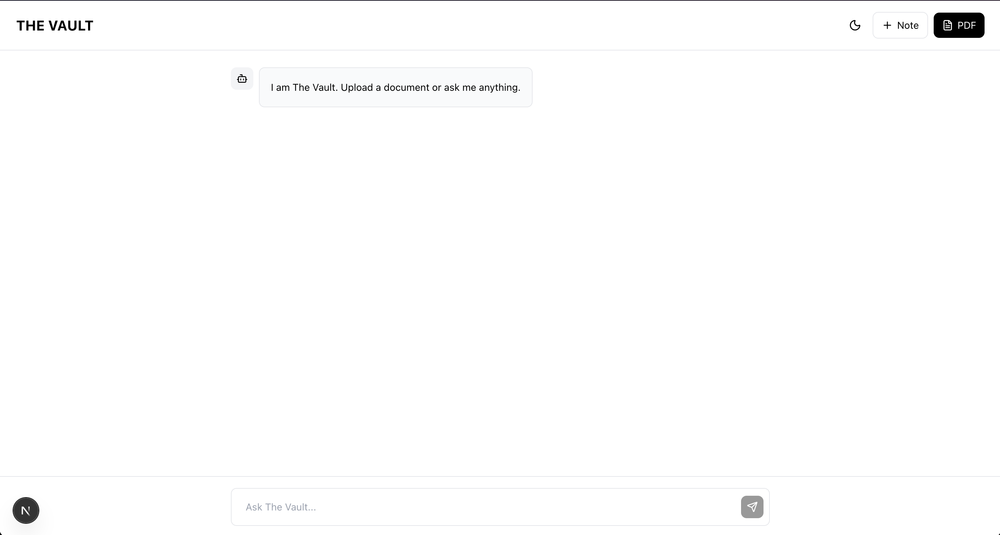

# 🔒 THE VAULT


> **An Enterprise-Grade RAG (Retrieval Augmented Generation) System.** > *Securely ingest documents, vectorize knowledge, and chat with your private data using local embeddings and cloud-native LLMs.*

---

## 📸 Demo



---

## 🧐 The Problem
Standard LLMs (like ChatGPT) cannot access your private files, legal contracts, or internal documentation. Uploading sensitive data to public models poses a security risk.

## 💡 The Solution: The Vault
The Vault is a **Private Knowledge Engine**. It uses **RAG (Retrieval Augmented Generation)** to turn your static documents (PDFs, Notes) into a searchable vector index.

When you ask a question, The Vault:
1.  **Searches** your private database for the most relevant paragraphs (Semantic Search).
2.  **Retrieves** that context.
3.  **Feeds** it to Llama 3.1 to generate a precise answer with **citations**.

---

## 🏗️ Architecture

This project is built using a modern **Microservices** architecture:

```mermaid
graph TD
    User[User (Next.js UI)] -->|Upload PDF/Text| API[FastAPI Backend]
    API -->|Generate Embeddings| VectorEngine[Sentence Transformers (Local CPU)]
    API -->|Store Vectors| DB[(Supabase + pgvector)]
    
    User -->|Ask Question| API
    API -->|Semantic Search| DB
    DB -->|Return Context| API
    API -->|Context + Prompt| Brain[Groq API (Llama 3.1)]
    Brain -->|Answer| User